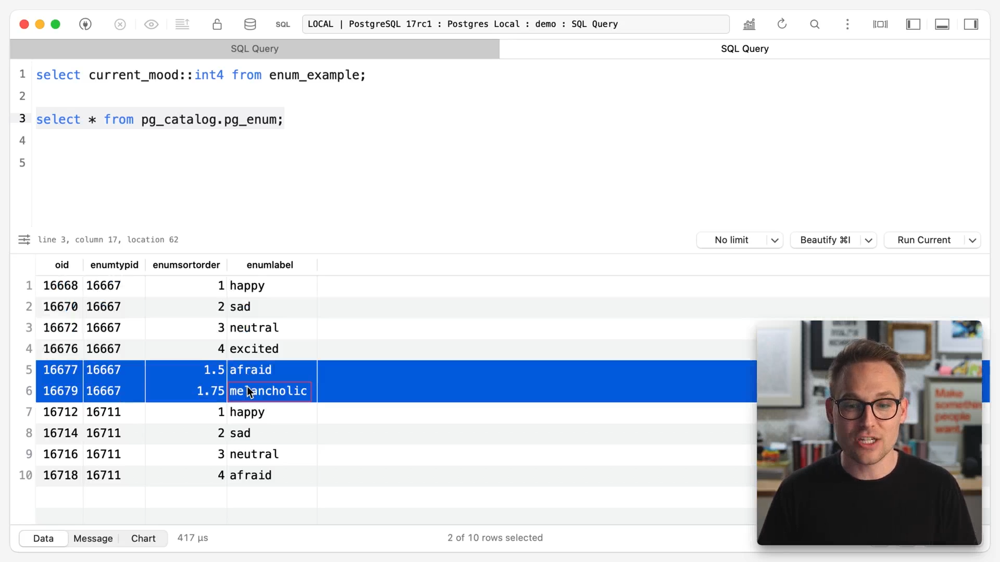

## 05.-Introduction-to-schema
### Schema
#### Schemas as namespaces
In sqlite and mysql you have a DB that has tables and ... . But in postgres, inside a db, first you have multiple schemas.
Think of them as schemas, and then inside of schemas you have tables. So in postgres there's one more level
of organization or hierarchy available to you.

You can't have nested schemas.

- sqllite: a single file that has a db in it and inside db are tables
- mysql: we have mysql server that inside of it can have multiple dbs and tables inside those dbs
- postgres: postgres server, cluster and the postgres process. Inside it, you can have multiple dbs, schemas and then tables

So tables live in schemas. By default, there's a public schema.

#### Schema as definition of the table

Table schema guidelines:
- keep them small(compact). If our range is 0-100, do not chose a bigger data type. Note: we can order the cols of the table to
  make the table even more compact.
- simple
- representative of data: we need to chose one data type that encompasses full range of our data. So do not mangle your data to save
  a few bytes. For example numbers shouldn't be stored in char cols.

The boundaries and shape of the data can match with one of the postgres data types.

For numbers we have:
- integers
- numeric
- floating points

## 06.-Integers
- int2 - smallint
- int4 - integer
- int8 - bigint

Integers that fit in a **bounded range**.

Postgres doesn't have the concept of unsigned integers as type. But we can still enforce integers of col being positive using check constraints.

int2: integer that takes 2 bytes => smallint.

It's better not to rely on datatype for data validation. For example, choosing smallint or int2 for age. It's better ot use check constraints
for business logic data validation.

So rely on data types for compactness instead of business data validation.

The only place to give our data way too much room to grow is primary key ids, because we don't want to run out of space.
For those, default to bigint(int8). It can also be used for sth like `file_size_bytes` col.

## 07.-Numeric
- integers
    - only support whole numbers
    - accurate
    - very fast
- numerics(or decimals)
    - support fractions of numbers
    - accurate
    - extremely slow
- floating points
    - support fractions of numbers
    - not accurate(approximation) - variable precision
    - very fast

- numeric == decimal
- When dealing with financial data like interest_rate, use numeric.
- Numeric supports a lot more bigger nums than int8.
- without passing args to numeric or decimal, it's unbounded precise num.
- numeric without args, accepts everything, kinda like `text` col. But with parameters, enforces some sort of range in terms of number of digits, kinda like
  character varying col.
- If you don't pass in the second arg, it would be 0.
- if you pass negative as scale, like: select 1234567.345::numeric(5, -2). It will round it from decimal place to 2 places in.
- the precision, represents number of significant un-rounded digits.

Note: numeric is a varying size datatype like varchar and text, unlike integers and floats. Since it allows any number, the num of required bytes does change.

numeric(<precision>, <scale>): the total number of digits is called **precision**. allowed number of digits after fraction point is **scale**.
```postgresql
-- we can represent 12.345 as numeric(5, 3) without losing precision
select 12.345::numeric(5, 3); -- 12.345
```

If you wanna store or cast a number with:
- total num of digits larger than the precision, you will get an err. Example: `select 123.345::numeric(5, 3)` -> `ERROR: numeric field overflow...`
- num of fractional digits larger than scale, it will round them and store it without err. Example: `select 12.345::numeric(5, 2)` -> stores: `12.35`

Interesting example:
```postgresql
select 1234567.345::numeric(5, -2)
```
result: 1234600 . So this works although the number we passed has 7 digits before decimal point, but scale is 5. This is because two digits
gonna be rounded down, so we would have 5 digits(the 0s are not counted). But look at the result. It has 7 digits! Since 5 represents significant un-rounded digits,
we CAN chop them off with passing negative val to scale, but CAN'T store vals with more than 5 significant digits.

So passing negative as scale, will round down digits before decimal point starting from right side. So in this example, 6 & 7 gonna chopped off and we will
have 0s there. The 0s are not actually stored, so it's not a padded digit.

## 08.-Floating-point
- real(float4, float(1-24)): 4bytes. Has at least 6 digits after decimal point
- double precision(float8, float(25-53): 8bytes. Has at least 15 digits after the decimal point.

These have a bunch of aliases as we saw. So float(49) will result in double precision. But typically we don't use them. We use `real` and
`double precision`.

Note: `float8` is considered `double precision` although it's in range of float(1-24) which is for `real`.

```postgresql
select 7.0::float8 * (2.0 / 10.0) -- 1.400...1
```
So when you do math with floats, you have to account for imprecision. So instead of equality, you might wanna subtract the expected result.
In this example: `select 7.0::float8 * (2.0 / 10.0) - 1.4 < .001` which is true.

Note: If you cast it to numeric, it will yield correct res.

### floats are faster than numerics
```postgresql
select sum(num::float8 / (num + 1))::float8
from generate_series(1, 20000000) num;

select sum(num::numeric / (num + 1))::numeric
from generate_series(1, 20000000) num;
```

## 09.-Storing-money
DO NOT USE money DATATYPE TO STORE MONEY.

```postgresql
create table money_example
(
  item_name text,
  price     money
);

insert into money_example(item_name, price)
values ('Laptop', 1999.99),
       ('Smartphone', 799.50),
       ('Pen', .25),
       ('Headphones', '$199.99'), -- we can use currency formatted string as money
       ('Smartwatch', 249.75),
       ('Gaming console', 299.95);
```

### What's the problem with money?
1. only 2 decimal precision. You would lose precision
2. there's no currency conversion when changing lc_monetary.

Note: ops with `money` are accurate.

EX:
```postgresql
select 199.9876::money; -- $199.99
```

So if you're working with US dollars and you don't care about fractional cents, then maybe money type is fine.
So the precision is up to 2 decimal digits.

The second that you need fractional cents(more than 2 decimal digits) or you're working in a currency where you need
more than 2 digits precision for fractional digits(like crypto currencies), you're toast.

### lc_monetary
Let's say you're storing everything in db as US dollars. It all depends on lc_monetary setting.

```postgresql
select 1000::money; -- $1,000.00

show lc_monetary;

set lc_monetary = 'en_US.UTF-8';

--  We can set it to great Britain pound sterling.
set lc_monetary = 'en_GB.UTF-8';
```
You can change lc_monetary val, but the problem is the values are not converted to that new currency. Just the currency sign.
That's because they were stored as US dollars and then we just changed the setting. We needed a currency conversion.

### Alternative options for money
We can't use floating points because they're not precise.

#### store everything as an integer in lowest unit 
store everything as an integer in lowest unit that you need. For example if you wanna store dollars and cents(but not fractional cents),
you can multiply values by 100, so store it as lowers possible unit which is cents.
So for $100.78 , to get it to integer, we just multiply it by 100 and store it, which means it's stored as cents:
```postgresql
select (100.78 * 100)::int4 as cents -- 10078
```

Now if your app needs to store fractions of a penny, so having 4 decimal digits, then you can multiple them by 10000 and store them:
So for $100.78 , to get it to integer, we just multiply it by 100 and store it(so we're storing thousandth of a cent), which 
means it's stored as cents:
```postgresql
select (100.78 * 10000)::int4 as thousandth_cents
```

So on **the way in**, we converted it to cents(or maybe thousandth_cents) and on the way **out**, you convert it back to **dollars and cents**.

Stripe does this approach. When we call it's apis, we have to send the money in the lowest unit of that currency.

#### Store as numeric
You can set precision and scale as well:
```postgresql
select (100.78)::numeric(10, 4) -- 100.7800
```
But numeric is slower.

### Storing multiple currencies
Have a separate col that stores the currency next to the value.

Note: You could store the val as numeric and then cast it to money, if you need help on the presentation of data in db. But do not store
the value using money data type.

## 10.-NaNs-and-infinity
numeric and floats have `NaN` and `Infinity`, but integers don't have them, so you can't cast nan to an integer type.
```postgresql
select 'NaN'::int4; -- doesn't work
select 'NaN'::numeric;
select 'NaN'::float4;

select 'Infinity'::float4;

select 'Infinity'::numeric(10); -- doesn't work
select 'Infinity'::numeric(10, 2); -- doesn't work
```

Why ints don't have Infinity? Because by definition integers are bounded but Infinity is unbounded.

- An open-ended numeric can store infinity, but a closed numeric doesn't.
- 'inf' can be used instead of 'Infinity'. 
- All `NaN`s and `inf`s are equal to other `NaN`s and `inf`s.
- `NaN`s are greater than all numbers.
- `'inf'::numeric + 'inf'::numeric` is `inf`, but `'inf'::numeric - 'inf'::numeric` is `NaN`.
- `select 'NaN'::numeric ^ 0` => 1 . But `select Nan::numeric + 1` => Nan

NaN exists(can be stored) only in unbounded cols which are numeric without precision and scale. So they can't be stored in int and float cols.

## 11.-Casting-types
Postgres impl of generic sql cast():
```postgresql
-- generic sql
select cast(100 as money);

 -- psql
select 100::money;

-- but how do we make sure that both casts produce the same output and are equal?
select pg_typeof(cast(100 as money)), pg_typeof(100::money);
```
If you need portability between sql impls, use `cast()`, but if you're just using postgres, use double colon.

Note: You shouldn't nerf your implementation because you might change your sql flavor in the future.

If you're writing a lib that could be used by people that use different sql flavors, then stick as closely to sql standard as possible,
or write drivers that leverage the power of each individual DB(flavor).

### Decorated literal
It's similar to cast() but not exactly the same.

```postgresql
-- here, `integer` is the decoration and '100' is the literal
select int8 '100';
```

### how much space a val occupies?
Note: `pg_column_size()`: tells how many bytes a certain thing occupies.
```postgresql
select pg_column_size(100::int2);
```
Pick the smallest column type that can hold the data because if a fixed value like 100 is stored in different col sizes, they occupy much more
space than storing it in smaller col type. Like storing 100 in int2 vs int4 vs int8.

For integers: even though the value itself is small(100), the size is determined by the col type. But for numerics,
the value affects the size.

So:
```postgresql
-- these two occupy the same space, 4 bytes:
select pg_column_size(100::int4), pg_column_size(100000::int4);

-- but these occupy different num of bytes(8, 12):
select pg_column_size(100::numeric), pg_column_size(100000.123::numeric);
```

## 12.-Characters-types
3 different types for character data
- `char(n) - character(n)`: fixed-length character type
- `varchar - character varying`: character varying type. It accepts vals up to n chars. If you don't pass the argument, it will
effectively be a `text`. So `varchar` without arg is `text`.
- `text`: unbounded char col

These 3 types are identical! They're the exact same thing! Under the hood they're stored in the exact same data structure.
So using the very compact fixed-length character type is no more performant than using a character varying or text type.
In fact, fixed-length character type might be the worst performing of the three types!

Note: If you insert a val that has fewer than n chars to a char(n) col, it gets padded with spaces(at the end). If val has more chars,
it throws an err.

**Do not use fixed-length character type(char(5)) type!** 

Drawbacks:
- it doesn't actually enforce the n char long, because in case the val is shorter it just padds it to be 5 chars. If the val MUST be exactly n chars,
you're toast, since we can insert vals with less chars.
- since under the hood, the storage of these types are all the same, you don't get any performance benefit from using a fixed-len char col.
It doesn't save any storage, so you get a bit of storage hit because it's storing all of those spaces in case the val is shorter and 
a bit of performance hit because quite often, it has to trim off those spaces back to give you the actual val.
- when comparing the vals of this type, the significance of white spaces depends(whether it's considered) on the collation, sometimes it depends on the
operator(LIKE, =, ...). For example, for `LIKE` op, the whitespaces are significant. But for eq op, they're insignificant. Just don't use this type!

We will see the correct way to enforce a 5 char limit, with correct approach, instead of using char(5).

Note:
- We can use unbounded char col with some check constraints.
- varchar(without arg) and text can hold arbitarry large texts.
- after the text(or varchar without arg) reaches a certain size, postgres has neat impl called `TOAST`(table of oversized attribute storage)
which takes large chunk of text and splits it out into a different table such that your **rows** on disk can still be compact and you can still
reach that oversized attr if you want. MySQL has the same thing. This is invisible to usergs. So don't put that large text col into another table
to avoid having a large row because it won't be large, postgres does this automatically.

Order of preference:
1. text
2. varchar
3. char(don't use this) - this type is different in other DBs

## 13.-Check-constraints
- For example, we don't have a number data type only for positive vals in postgres. In other DBs, we can declare a col as UNSIGNED INT and
we get the entire bytes for positive nums, but not in postgres.
- And don't use fixed-width char col, instead use a check constraint.

The easiest way of data integrity(business or domain logic) writing validations, so that bad data can't get in. This is an example of
**col constraints**:
```postgresql 
create table check_example(
    -- we have a col constraint here
    price numeric check ( price > 0 ), -- should be > 0
    abbr text -- should be exactly 5 chars
);
```

```postgresql
create table check_example (
  price numeric
    constraint price_must_be_positive check ( price > 0 ), 
  abbr text check ( length(abbr) = 5)                     
);

insert into check_example(price, abbr) VALUES (1, 'foo');
```

**Col constraints sit next to the col's data type and they reference a single col.** It's a best practice if you're gonna 
reference multiple cols to move it down to a table constraint.

Every col constraint can be written as a table constraint but not every table constraint can be written as a col constraint.
So if you have a check constraint that references more than one col, write it as a table constraint. 
```postgresql
create table check_example (
  price numeric
    constraint price_must_be_positive check ( price > 0 ),
  discount_price numeric,
  abbr text,
  
  -- table constraints
  check ( length(abbr) = 5 ),
  
  -- this still can be written as col constraint but it's a bad practice
  check ( price > check_example.discount_price )
);
```

Q: Check constraints are great but how much of business logic you should put into the DB?

A: When it comes to enforcing data integrity, put it into the DB. There's difference between business logic integrity and data integrity.
For example price > 0 or len(abbr) = 5, are data integrity. Do not put complex triggers in DB to do business logic.
So you can put data integirty in DB layer instead of app layer. Especially if not all of your data updating and inserting goes through the app,
then you need these checks in db.

Note:
- Check constraints can't reference other tables or another row besides the one that's being updated or inserted.
- if you wanna change the check constraint, you do have to drop and recreate it, you can't just alter it(though you can alter it only for
changing name, but not to change the logic). Note that you can do drop and recreate in a single statement such that you don't have race condition
where someone else can put some bad data in there.

## 14.-Domain-types
In check constraints, the declaration was: `<col name> <datatype> <check constraint>`. 

A domain wraps up the `<datatype>` and the `<check constraint>` into one custom name. So it's kinda like a custom type except
it relies on an underlying type and it's a combination of a type and some constraints.

```postgresql
-- in US, you can have a postal code that's <5 chars> long or this format: <5 chars>-<4 chars>. It can have a leading zero too like:
-- 05345-2341. So you don't want to declare postal_code as numeric or int, because you might lose that leading 0 and also it wouldn't
-- support the dash.
-- NOTE: We can use check constraint here as well.

create domain us_postal_code as text constraint format check ( 
    -- value must match the given regex
    -- NOTE: Here, we're referring to the actual value with `VALUE` not the col.
    VALUE ~ '^\d{5}$' or VALUE ~ '^\d{5}-\d{4}$'
);

create table domain_example (
    street text not null,
    city   text not null,
    postal us_postal_code not null
);

insert into domain_example(street, city, postal) VALUES ('main', 'dallas', '7432'); -- fails
insert into domain_example(street, city, postal) VALUES ('main', 'dallas', '74320-09a9'); -- fails
```

With domains, we can use them across multiple tables unlike the check constraints.

Note:
- With domains, you're not creating a custom data type, you've just wrapped up a regular datatype and a constraint.
- In domains, we can't reference multiple cols but in check constraints, we can(table check constraints).
- We can alter a domain, but we can only alter the name of a check constraint(we have to drop and recreate it for other changes).
- When altering domains, we can say to validate the constraint only against new rows not the old ones. So that might be a good way
to gradually roll out a new constraint. So we can leave the old data there until we can update the data to be valid and then, we can
again alter the domain and enforce the new rules once all of our our data is clean.

So with domains, we can reuse them. So if we have price, age, birthday or postal code, or god forbid validating email addresses with
regex(don't do that), we can reuse the domains across multiple tables that have those cols, to keep the logic consistent, whereas with
check constraints, we have to update them in all the places, since we can't share them.

## 15.-Charsets-and-collations
Charsets and collations of our text content.

You should be fine with defaults.

### What is a character set(or an encoding) and what is a collation?
Is how we go from a character on the screen to the bytes written on the disk. UTF-8 is multi-byte encoding, between 1 to 4 bytes.
So it supports accented characters, foreign lang chars and ...(supports the entire range of unicode and emojis).

`UTF8` is extremely versatile and it can store anything and you won't end up with those weird question mark boxes when you try to display
some special char.

Charset defines what legal characters are and it might define the entire chars in unicode. So if you're using a different encoding(charset) and
you try to insert sth with an accented char or foreign language char or emoji, you might get an err. Because it's not representable in
that encoding.

### Collation
Like `en_US.UTF-8`.

A Collation is a set of rules that defines how those characters relate to each other.

For example, you might be comparing `a` with `A`, or e with è. Or those the same thing? Well it depends on the collation.

When you run `\l` in psql, it shows the **server's** encoding. It lists the info such as the encoding of each DB on the DB.
Your client with which you're connecting to postgres, also has an encoding. We can see it in psql client by:
```shell
show client_encoding;
```

If you change your `client_encoding`, postgres will attempt to convert the server-encoded data to your client encoding, but that's not always
possible, because the overlap of encodings is not a perfect circle(encodings don't overlap always). There are some chars that can be
represented in one encoding but can't be represented in another encoding. If client_encoding and server's encoding is different, you need to
convert some of the chars yourself. 
```postgresql
select 'abc' = 'ABC' collate "en_US.UTF-8" as result; -- false
```

Note: en_US.UTF-8 collation is case-sensitive.

### creating a collation
We can create our own collation. Why? For example, we wanna search a col for an email and the input str lowercase. There are maybe potentially
better ways to do that, than creating your own collation. Some solutions:
- downcasing the input
- if prev solutions is not viable, we can create a generated col that is downcased
- or create a functional index that uses lowercase email

```postgresql
create collation en_us_ci (
    provider = icu,
    locale = 'en-US-u-ks-level1',
    deterministic = false
  );

select 'abc' = 'ABC' collate "en_us_ci" as result; -- true!!!
```

- icu stands for international components for unicode. Your postgres hopefully will be built with this, if not, then you can't use `icu` provider.
Though it's pretty standard, so you should have it.
- `level1` is the least sensitive level.
- deterministic = false because when you have things that are case-insensitive and accent-insensitive, it's possible those could end up
in any order, because the comparison could be totally equal.

Note: If you're just creating a collation for case-insensitive searching, you have these opts:
- the `ILIKE` operator which can be good or bad. Why bad? Because it may not be as index-assisted as we want.
- We also have generated cols
- functional indexes

Note: You can create a specific text col with it's own encoding or collation, if that meets your use case.

For most of the use cases,` UTF-8` encoding(charset) and e`n_US.UTF-8` collation are fine. But you might need other ones if you're building an app
for a different lang than English. You might change collation to French or ... .

## 16.-Binary-data
You can store up to 1GB of data in binary col of a row. But it's not good. Remember that when you store large amounts of data,
it gets `TOAST`ed. Where db automatically holds a pointer in the row itself and breaks the data out into the TOAST table.
So the rows still will be compact. If your data is large, use file storage like s3 and leave a pointer like filename or url in the db.

One of good things about storing very small files in the db, is we get strong consistency guarantees, whereas you might 
delete the file off of s3 and the pointer to it is left dangling(we lost consistency).

Storing files is not good overall. Better use cases for storing raw data is for example **storing checksums**. Storing them in db, 
makes it fast to compare. Because you don't care about encoding and collation and ... , since you're literally just checking bytes! So no need
to see the encoding for convert the chars into bytes, we already have the bytes.

```postgresql
create table bytea_example
(
    file_name text,
    data      bytea -- bytea is variable-length binary type
);

insert into bytea_example (file_name, data) values ('hello.txt', '\x486...'); -- \x represents hex data 

-- this is how you can control what bytea output the client gives back to you. The default is `hex` and it's the one you should be using.
show bytea_output; -- result: hex

-- there's an older version for bytea_output that you can use which can be nice when you're a human! Because it will convert the bytea output
-- to characters. But remember not all bytes(bytea) can be converted to chars! You may have stored raw bytes there that weren't originally characters!
-- So escape can't convert them to characters. In other words, it's gonna muck those up.
set bytea_output = 'escape';
```

**Stick to hex.**

### Storing Digests
```postgresql
select md5('hello world');
```

**md5 is not secure** Do not use it for sensitive data. Though it's superfast for digests and hashes where you need strict equality across a potentially
big piece of data that you can compress down using md5() and then doing strict equality lookups.

Note that **even** using md5 as a hashing func, you could potentially get dinged on a security audit, in that case, you need to switch to
sth like sha256.

---

```postgresql
select pg_typeof(md5('hello world')); -- text
select pg_typeof(decode(md5('hello world'), 'hex'));-- bytea

select pg_typeof(sha256('hello world')); -- bytea
```
This is a quirk. md5() returns text but sha256() returns bytea. If you wanted to make md5() as bytea, you use `decode()`.

Q: Why we care about making the results of these funcs as `bytea` and not chars using `text` type?

A: Because we don't care about reading those vals as texts, we just want to do strict equality comparison between two hashes.
So we convert them to bytes, to make them compact and faster.

Q: Why it's 20 bytes? I though md5 produces 16bytes!
```postgresql
select pg_column_size(decode(md5('hello world'), 'hex')); -- 20
```

A: Because there's a bit of bytea overhead.

Now if you compare the text format of a str and it's decoded(bytea) format, the bytea is more compact. Because we got rid of character info and
we just go down to straight bytes, so that's good:
```postgresql
select pg_column_size(md5('hello world')), pg_column_size(decode(md5('hello world'), 'hex')); -- 36, 20
```

Note: A great way to do strict equality lookups is hashing them and store their hash as potentially a generated col, then call decode()
to store it as bytes, not text, so it's more compact. But there's a simpler way:
```postgresql
select md5('hello world')::uuid, md5('hello world'); -- uuid has some dashes

select pg_column_size(md5('hello world')), -- 36
       pg_column_size(decode(md5('hello world'), 'hex')), -- 20
       pg_column_size(md5('hello world')::uuid); -- 16.
```
WOW!!!! uuid is more compact than text and bytea!!!!!!!!!

So **uuid is smallest possible representation of an md5 hash.**

**So for storing digest(hash), use uuid as the col type of the hashes value.**

## 17.-UUIDs
We're gonna talk about UUIDs as a datatype not as primary key. We will talk about that later.

If you don't care about `bigint`s vs UUIDs as primary key, use `bigint`. The reason has to do with fracturing the btrees.

The claim of uuid(universally unique identifier) being universally unique is strong! In fact, it's a fair claim because
you're more likely to get hit by lightning 40 times than have a uuid collision.

UUIDs are useful for generating ids without coordination. That could be in separate systems(like separate companies), a distributed systems maybe
on different machines, or generating them on the client(maybe you're doing optimistic UI and we need to generate an id on client).

The type of uuid is not string(varchar or text), it's uuid.

Note: uuid col is 16 bytes.

Why postgres uuid type is the perfect type for uuid values? Because it's more compact and faster to operate than
other data types that can hold uuid vals, like
`text` or `varchar`.
```postgresql
create table uuid_example
(
  uuid_value uuid
);

select pg_column_size(uuid_value::text), pg_column_size(uuid_value)
from uuid_example; -- 40, 16
```
Why storing uuid in text would make 40bytes? Because it's 36bytes of string and 4bytes of overhead.

The only type of uuid that postgres can generate out of the box(without extension) is random uuid:
```postgresql
select gen_random_uuid();
```

At this moment, there are 8 versions of uuid and they don't supersede each other, they are simply different versions.

Each segment between dashes in an uuid, is representative of some type of data, whether it's a timestamp, random bits, machines,
entropy or ... . So each segment(piece) has it's own kind of domain that it's responsible for and the different versions of uuid, all do it
a bit differently.

The good thing about uuid v7 which is not in postgres by default(you need to install it's extension), is the first part(segment) is a
representation of timestamp. It's lexographically sorted. You could extract the timestamp out of the UUID.

**UUID v7 could make a good primary key. However, `gen_random_uuid()` would make a terrible primary key.**

## 18.-Boolean
Some other dbs have a boolean type that's an alias to satisfy the SQL standard and under the hood they just use a tinyint. But this isn't true in
postgres. Postgres has a datatype for everything including boolean.

We have 3 states: true, false, null(unknown)

```postgresql
create table boolean_example
(
  id     serial primary key,
  status boolean
);

insert into boolean_example(status)
values (TRUE),
       (FALSE),
       ('t'),     -- TRUE
       ('f'),     -- FALSE
       ('true'),  -- TRUE
       ('false'), -- FALSE
       ('1'),     -- TRUE (Note: must be quoted can't be an integer)
       ('0'),     -- FALSE (Note: must be quoted can't be an integer)
       ('on'),    -- TRUE
       ('off'),   -- FALSE
       ('yes'),   -- TRUE
       ('no'),    -- FALSE
       (NULL); -- NULL essentially means 'unknown';


select '1'::boolean;

select 1::boolean; -- you can cast the 1 (int) to boolean

insert into boolean_example (status)
values (1); -- but you can't insert the 1 (int) into the table

select pg_column_size(1::boolean), pg_column_size(1::integer); -- 1, 4
```

A `boolean` type in postgres is **1 byte**. It's very compact. So for boolean values, don't use int2, use boolean. Because int2 supports up to 32767.

It's better to use TRUE and FALSE, instead of t or f or ..., because they are bool already, so no need to coerce them.

### When not to use bool
If you have more than 0,1, null or you're doing bitwise operations, there's a better type for that.

## 19.-Enums
### When NOT to use
- If the possible opts are changing, do not use an enum.
- if the states have other info as well. In that case, just make it it's own table and add foreign key

Note: Sometimes a check constraint is better than enum.

**Note: Be aware of sorting of enums quirk!**(not a real quirk though)

```postgresql
create type mood as enum('happy', 'sad', 'neutral'); 

create table enum_example (
    current_mood mood
);
```

Note: Ordering based on an enum col is not alphabetically, it's ordered by the order that you **declared** the values of enum.
This characteristic can be useful when your enum is like:
- x-small
- small
- medium
- large
- x-large

This ordering makes sense than having them alphabetically when ordered. This is not a quirk, it's just how it works.

### adding val to enum
```postgresql
alter type mood add value 'excited'; -- now when we order by mood, excited rows will appear last

alter type mood add value 'excited' before 'sad';
```

### Altering enums
Removing a val from an enum is not possible, so you have to drop it and create a new one:
```postgresql
create type mood_new as enum ('happy', 'sad');

alter table enum_example
    alter column current_mood type mood_new
        using current_mood::text::mood_new; -- ERROR: invalid input value for enum mood_new: "excited"
```
This is because some rows have value "excited" which is not in mood_new enum, so we can't cast that col to mood_new, since it has unexpected values.
We need to get rid of the values that are not supported in the new enum that we wanna change the type to.

Workaround:
```postgresql
begin;

update enum_example
set current_mood = 'neutral'
where current_mood not in ('happy', 'sad');

alter table enum_example
  alter column current_mood type mood_new
    using current_mood::text::mood_new;

commit;

-- now you can safely drop the old enum and if you want, rename the new enum type to `mood` not `mood_new`.
```

### Under the hood of enums
We know enums are stored as ints, but we can't cast them to ints easily:
```postgresql
select current_mood::int4 from enum_example; -- non of the ints work
```

```postgresql
select * from pg_catalog.pg_enum;
```
This query returns custom enums and their `enumtypid` which is the id of our declared enum type, for example `mood` enum gets id of 16667.

Look at how pg handles inserting before and after vals in an enum. It splits the difference of `enumsortorder`. This `enumsortorder` col is the one
used in sorting of an enum col.


So when we sort by an enum col, the actual query would be sth like:
```postgresql
select *
from pg_catalog.pg_enum
where enumtypid = 16667
order by enumsortorder;
```

Note: If you forget the vals and their order in enum currently, you can run:
```postgresql
-- mood: {happy,afraid,melancholic,sad,neutral,excited}

select enum_range(null::mood);

-- this will output the vals up until 'sad' in enum
select enum_range(null::mood, 'sad'::mood); -- {happy,afraid,melancholic,sad}

-- what are the vals in range of 'afraid' till 'sad':
select enum_range('afraid'::mood, 'sad'::mood); -- {afraid,melancholic,sad}
```
This func is useful if your enums have semantic meaning and you declared them in the right order.

You can use check constraints instead of enums. If you use check constraint on a string col, you lose that compact storage of enums under the hood,
since you're gonna be storing strings not ints. But check constraints are easier to alter.

**If the vals are constantly being added and removed in terms of what are the legal vals, you can use a text col with check constraint or domain.
But if the list of vals are fixed, you can use an enum.**

Note: If you're not in the habit of looking at your data in a view amd you're only working with data on the application code, it's ok to
make that status col an int instead of an enum. But we would have 1, 2, 3, 4 ... as vals instead of nice representations of enum.
So without looking at the application code, we don't know the meaning of vals in rows.

## 20.-Timestamps
Timestamp is a date and time together. In postgres, datetime is called timestamp. There are two options to store datetime in pg:
- timestamp without timezone: pg doesn't any conversions
- timestamp with timezone(timestamptz): pg takes the val that you give it, convert it to UTC to store it in db and then when you read the val(pull it back),
it's gonna convert it to whatever timezone you are in

So when a val comes in for a `timestamptz` col, pg is gonna convert that val to UTC to storage and then when reading it, it will convert it back
to whatever timezone of the session is. So the conversion happens if the db or session tz is not set to UTC.

- These both support the same range and same number of bytes for storage.
- **ALWAYS** use timestamp **with** timezone.
- It's not useful to store a time separately, however a separate date col could be useful.
- when you choose `timestamp` as a col type, it's without timezone by default

```postgresql
create table timestamp_example (
    "id" serial primary key,
    "timestamp" timestamp
);
```

### args to timestamp() and in future datetime behavior
You can pass 0 to 6 to timestamp() or timestamptz() and it specifies how many fractional seconds you want to store.
If you don't pass it anything, it will use the literal and won't have truncation of fractional digits.

```postgresql
select now()::timestamptz(3); -- 2025-01-28 08:26:13.569 +00:00 . So we have 3 fractional digits: 569

select now()::timestamptz(1), now()::timestamptz(0), now()::timestamptz; -- 2025-01-28 09:29:03.8 +00:00, 2025-01-28 09:29:04 +00:00, 2025-01-28 09:29:03.832300 +00:00
```
In the second query, as you can see the one with `0` as arg, **is in future** at the time we ran the query! Because it's second is 04, but the other two are 03.
Why? Because it was rounded up to truncate fractional digits.

If you don't want this rounding up to future behavior and don't want the fractional digits, instead of casting to timestamptz(0), you can use `date_trunc()`.
With this func, we won't get the datetime in the future.
```postgresql
select now()::timestamptz(0), date_trunc('second', now()); -- 2025-01-28 09:41:28 +00:00, 2025-01-28 09:41:27.000000 +00:00
```

Pg is very forgiving on the formats for dates. But we don't like this behavior. We don't like leaving it to pg to figure out what this datetime means.
**We want to always communicate in ISO8601.**

### ISO8601
- `year-month-day hour:minute:second:<potentially fractional second>.<potentially timezone>`
- `2024-01-31 11:30:08.234+<04:00>` or could be written like: `2024-01-31T11:30:08.234` or `2024-01-31 11:30:08.234Z`. There's also a timezone
that has 30minutes offset off UTC, so the timestamp in that tz would be like: `2024-01-31 11:30:08-00:30`
- Z stands for zulu which is +00

ISO8601 is not ambiguous, but we have some ambiguous formats like: 1/3/2024 or 3/1/2024. **What do these dates refer to? Well, it depends
on where you are in the world!** If you're in USA, first one means Jan 3rd and second is March 1st. If you're literally anywhere else
in the world, first one is March 1st and second is Jan 3rd. So it's ambiguous.

This is how we control how pg interprets ambiguous dates. But not that you shouldn't give pg ambiguous dates in the first place.
```postgresql
-- we have two settings! the first part determines the output. The second part determines the ambiguous date format.
show datestyle; -- ISO, DMY
```

**So when we have 1/3/2024, pg says: well that is ambiguous, but I can use second part of datestyle(which in our case is DMY).**
So day is 1, month is 3.

We can change that setting:
```postgresql
set datestyle = 'ISO, MDY';
```
Now, 1/3/2024 is interpreted as 2024-1-3. So month is 1, day is 3. 

**Note: 1/3/2024 is ambiguous. but the 2024-1-3 is not.**

### Other date formats
There's also the SQL output format. It's in fact not in SQL standard. This is a lucky or unlucky coincidence of naming.
```postgresql
set datestyle = 'SQL, DMY';

select '2024-01-31'::date; -- 31/01/2024
```

For some reason, Germans have their own date style in pg:
```postgresql
set datestyle = 'German, DMY';

select '2024-01-31'::date; -- 31.01.2024
```

Another format which covers both output format and ambiguous output format:
```postgresql
set datestyle = 'European';

select '2024-01-31'::date; -- 31.01.2024
```

Always use ISO8601 so that there's no ambiguity and you're not relying on datestyle server setting. 

### unix timestamps
They're just numbers(int or floats if there are fraction of second). To convert them to timestamptz, use `to_timestamp()`.
```postgresql
select to_timestamp(<unix timestamp>); -- returns a timestamp like: 2023-09-15 09:41:28 +00:00

select pg_typeof(to_timestamp(<unix timestamp>)); -- `timestamp with time zone` and it's timezone is UTC
```

Unix timestamp always have +00:00 as timezone offset. Why? Because a **unix timestamp is an offset from the EPOCH at UTC.**

## 21.-Timezones
- Keep it in UTC for as long as possible. Convert it to whatever the user needs at the latest moment possible.
- use named timezones not offsets

Keeping everything in UTC is a matter of making sure that your timezones are set to UTC.

You can set the timezone per session in 1) the CLI or 2) in psqlrc file. So when we set it in session, if we disconnect and reconnect,
it would reset to the db or cluster timezone. To set it in CLI:
```postgresql
show time zone; -- UTC

set time zone 'America/Chicago';
```

To change db timezone
1.
```postgresql
-- 1
alter database demo set time zone 'UTC';
```
2. To change cluster-level timezone:
```postgresql
show config_file; -- .../postgresql.conf
```
Note that you have to reload the conf file **and** if a db has delcared it's own discrete timezone, then the default postgresql.conf won't apply.
The order of confs:
1. postgres.conf 
2. db conf 
3. the session

```postgresql
select '2023-09-15 09:41:28'::timestamptz; -- 2023-09-15 09:41:28.000000 +00:00
```
The query shows tz of +00, it's because the tz of server is UTC(`show time zone`).

If you pass a timestamp literal(value) that doesn't have a tz and cast it or store it to timestamptz or store, it's gonna pick the tz of server.

```postgresql
set time zone 'America/Chicago'; -- sets session tz

select '2024-01-31 11:30:00'::timestamptz; -- 2024-01-31 11:30:00.000000 -06:00
```
Wow what happened?

The timestamp we have in select, is in UTC but when it was cast, but the timezone of client session is Chicago, so it's gonna convert
the val from Chicago to UTC, which means decreasing the hour by 6.

But this is hardly ever what we want. Instead, most of the time, we(client session) want to get back UTC from pg db. So we shouldn't alter the
client session tz and then maybe later in the app, we will change that.

### caveat: use a named timezone
1. it's gonna cover daylight saving time
2. it's not gonna shoot you in the foot when you accidentally flip a sign

Named timezones are better:
```postgresql
select '2024-01-31 11:30:00'::timestamptz as utc, -- 2024-01-31 11:30:00.000000 +00:00
       '2024-01-31 11:30:00'::timestamptz at time zone 'America/Chicago' as amch, -- 2024-01-31 05:30:00.000000

       -- we're using abbreviated tz here, you may have to specify daylight saving yourself
       '2024-01-31 11:30:00'::timestamptz at time zone 'CST' as cst, -- 2024-01-31 05:30:00.000000 .
       '2024-01-31 11:30:00'::timestamptz at time zone 'CDT' as cdt; -- 2024-01-31 06:30:00.000000
```
So we got a 6 hours difference.

You can use hour offsets, but it could get wrong results!. 
Like: `select '2024-01-31 11:30:00'::timestamptz at time zone '-06:00' as hour_offset; -- 2024-01-31 17:30:00.000000`.
The result is clearly wrong. The correct answer is 2024-01-31 05:30:00.000000. But if we change the tz sign to `+` (+06:00),
the result is correct. But we know the central timezone is -06:00. This is the problem of using hour offset.
Using `interval` will also yield the correct result(with correct tz) somehow:
```postgresql
select '2024-01-31 11:30:00'::timestamptz at time zone interval '-06:00' as interval_offset; -- 2024-01-31 05:30:00.000000
```

When you specify a tz for a timestamp, it's type would be `timestamp without timezone`, so this op should be at the end of your
pipeline where you're just displaying it out to the user - you're no longer doing date math on it.

```postgresql
select pg_typeof('2024-01-31 11:30:00'::timestamptz at time zone 'America/Chicago'); -- timestamp without timezone
```

Note: In full timezone name, the daylight saving time is implied, but in abbreviation form, you might handle it yourself. So full 
timezone name is kinda better.

There are 3 ways to specify timezones(the first approach is preferred):
1. full name(implies daylight saving time)
2. abbreviation (fine if you can't use full name)
3. POSIX-style(bare offset). not preferable, but may be necessary if no suitable IANA tz entry is available. Note that offset sign is the opposite in this format.
If for whatever reason you must use hour offset, use `interval` keyword.

**Note:** The offset sign in POSIX-style of tz is the **opposite** of ISO8601 sign convention!!!! Meaning the positive sign is used for zones **west** of Greenwich.
This is the reason why we used + sign for America/Chicago tz offset in prev examples. Although America/Chicago is west of Greenwich(used for UTC) and
should have negative offset sign.

To get a list of tz names:
```postgresql
select * from pg_timezone_names
where name like '%Chicago';
```

You could be in daylight saving time(DST), but a date that you've been operating on, exist in central standard time(CST), but as long as you
use named timezone identifier, you're gonna be OK.

### CST and DST
If a database tz is set to America/Chicago, it will automatically switch between CST (UTC-6) and CDT (UTC-5) depending on the time of the year.

## 22.-Dates-and-times